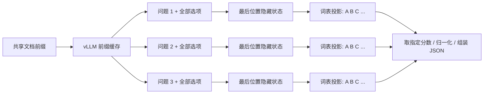

# 从语言模型到分类器

## 1. 模型看到什么

输入有两个独立概念：文档是证据，问题与候选描述定义任务。例如，“6 月 3 日签收”是文档；“是否晚于承诺日期？”是问题；“延迟 / 未延迟 / 信息不足”是调用方提供的选项。

编译器使用固定系统指令和 Qwen 原生模板，生成以下语义结构：

```text
system: 根据文档、问题和完整候选定义，选择一个代号。
user: CONTEXT_JSON: "很长的文档……"
user: TASK_JSON: {"question":"是否延期？","options":[
  {"code":"A","id":"late","description":"超过承诺日期才送达"},
  {"code":"B","id":"on_time","description":"承诺日期之前或当天送达"},
  {"code":"C","id":"unknown","description":"证据不足"}
]}
assistant: <原生模板中的非 thinking 前缀>{"answer": "
```

模型通过预训练/指令训练获得的能力理解这些自然语言边界。边界明确不等于语义判断必然正确。JSON 编码和对 `<` 的转义可以避免输入中的角色特殊 token 被解释成模板控制符，不能保证模型抵抗语义上的提示注入。

两个连续 user 消息用于把文档与问题分开。编译器仅在特殊 token 后切分，CPU 测试验证“分段编码后拼接”与“完整编码”逐 token 一致；不能简单按任意字符位置切分 BPE 文本。本方案使用的[固定 Qwen 模板](https://huggingface.co/Qwen/Qwen3.8-27B/blob/1d4bf0f2ff6012fd82039f2fa52739d0dd7c60c0/chat_template.jinja)支持这种消息布局。

## 2. 并行的是哪些计算



对一个问题，最后位置的隐藏状态是向量 `h`，原有 LM head 做一次词表投影 `z = W h`。`z` 已包含每个词表 token 的分数。A、B、C 的分数来自这个向量的不同坐标；不需要生成 A 后再生成 B，更不需要独立处理三遍文档。

对多个问题，每个问题有自己的最后隐藏状态，各自独立评分。vLLM 将请求放进批次，并尽可能复用相同文档前缀。物理执行可能因调度、分块预填充和显存限制分成多个批次。

一次评分包含长前缀所需的 prefill 和最后位置的词表计算；接口还采样一个输出 token，但程序丢弃它。不能将“单位置评分”说成“整个文档只做一个廉价矩阵乘法”。

## 3. 为什么要分配代号

若直接取候选文本的第一个 token，“允许退货”和“允许换货”可能共享同一个 token，无法代表两类。不同候选还可能长短不一。我们保留完整候选语义在提示词里，仅将输出槽映射到不同单 token。

注册过程检查 `encode(slot + code) == encode(slot) + [token_id]`，以及 token 不特殊、不重复、可正确解码。它不假定所有大写字符串都是单 token。固定版本的 Qwen tokenizer 实测得到 588 个可用代号，默认只开放前 256 个；运行时重新验证，不盲信写死的 ID。

## 4. 概率为什么相加为 1

设全词表 logits 为 `z`，候选 ID 集合为 `C`。vLLM 返回的是全词表归一化后的 `l_i = z_i - logsumexp(z)`。

```text
softmax(l_C / T)_i
= exp(z_i / T) / sum_{j in C} exp(z_j / T)
```

全词表的公共归一化项消掉了，因此无需把全部词表传回客户端，也无需修改模型 head。`T=1` 时，这恰好是把下一 token 限制在候选集合后的条件概率。

它不是完整候选描述的生成概率，也不是 ground truth 正确率。即便所有选项都不适合，归一化仍必然给出一个赢家。因此业务上应提供“信息不足/不适用”等显式选项，并用有代表性的标注集评估。改变选项顺序、措辞和代号可能影响结果。

## 5. 为什么不用 top-k 或单独归一化每批

自然 top-k 可能包含换行、引号和其他词，而漏掉真正候选。缺失候选的概率不是零。我们使用 vLLM 的指定 ID 取分能力；任何候选缺失、非有限值或截断哨兵值都会使请求失败。[completion 请求定义](https://github.com/vllm-project/vllm/blob/v0.29.0/vllm/entrypoints/openai/completion/protocol.py)

固定版本每次最多接受 128 个 `logprob_token_ids`。若有 256 个候选，调用两次，每次传入**相同的完整提示词**，分别要求两个 ID 子集；将全词表 log probabilities 合并，统一 softmax。每批先做 softmax 会丢失批与批之间的相对尺度，这是错误做法。[SamplingParams 限制](https://github.com/vllm-project/vllm/blob/v0.29.0/vllm/sampling_params.py)

各次前向在有限精度下可能有微小差异，本项目不承诺跨设备/批次逐 bit 一致。为避免改变取分含义，启动使用 `raw_logprobs`，关闭采样过滤与惩罚，不设置 `allowed_token_ids`、logit bias 或 guided decoding。输出文字不参与分类。

## 6. 缓存在哪里共享

应用只缓存文档的 token IDs。引擎负责 GPU 注意力缓存和混合层状态，不通过 Python clone/deepcopy 复制整份 KV tensor。vLLM 的前缀缓存以块管理，复用依赖相同 token 前缀、缓存盐和可用块。[vLLM prefix caching 设计](https://docs.vllm.ai/en/v0.29.0/design/prefix_caching/)

Qwen3.8-27B 的配置包含 full attention 和 linear attention 混合层。线性注意力的递归状态不能简单视为普通 Transformer 的整条 KV 序列，因此启用 `mamba-cache-mode=align`，让引擎处理兼容状态检查点。[模型配置](https://huggingface.co/Qwen/Qwen3.8-27B/blob/1d4bf0f2ff6012fd82039f2fa52739d0dd7c60c0/config.json)、[vLLM CacheConfig](https://github.com/vllm-project/vllm/blob/v0.29.0/vllm/config/cache.py)

冷文档上，立即并发几十个请求可能让它们在第一个请求产生可复用状态前同时开始 prefill。`auto` 因此让第一个真实评分完成，然后放行其余请求；同一文档同时到达的请求共享这道等待屏障。这只是调度提示，不能防止引擎随后驱逐缓存。低并发短文档可比较 `parallel` 与 `auto`，不存在保证所有场景都更快的策略。

特别是混合层缓存，首次长文处理后不一定能复用全部文档状态。观察 `backend_cached_prompt_tokens`，运行缓存一致性测试，并用目标长度压测；不要用 CPU 缓存命中标志代替 GPU 缓存命中。

## 7. 使用边界

各问题独立分类，能保证返回值来自各自合法候选集，但不能自动保证多个答案的业务关系一致。若业务有约束，例如“未送达”不能同时“已签收”，应在上层使用明确规则拒绝矛盾结果，或把有关状态合成一个联合候选问题；当前 API 不宣称支持任意 JSON Schema 推理。
